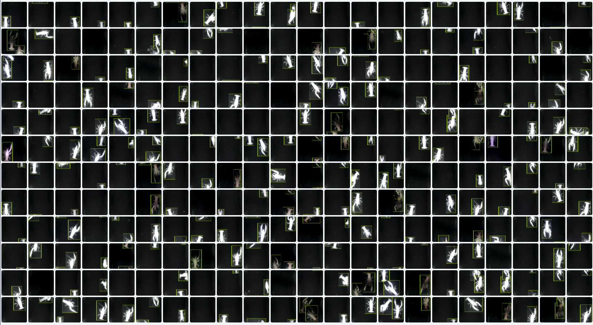
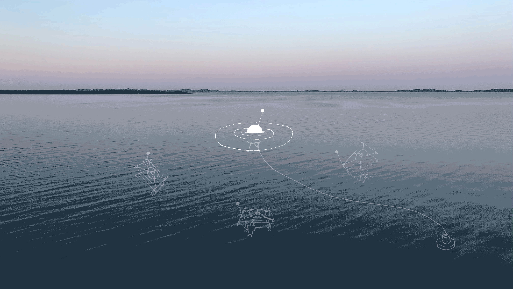

 

## <em>  Aquatic Arthropod Trapping with CV  </em>

###  1.01 Introduction.  

In the lobster country of New England, from Massachusetts to Nova Scotia, lobster trapping practices waste immense amounts of time and resources as fishermen check all traps everyday to look for lobster. Often these traps come up empty, but if the traps aren't checked and they contain lobster then these lobsters can die or be eaten by other more agile animals. For this reason, traps must be checked constantly. This wastes immense amounts of fuel and time. Remote sensing technology in this field could improve the efficiency of these trapping practices, could save on fuel expenses and emissions, and could potentially allow a fisherman to put traps in a greater range of locations.  

Using an automated set up using OpenCV, a 1600+ image dataset was produced from different live crawfish of varying sizes living in an aquarium. These images were used to train a model to recognize crawfish and this object detection model was built upon to create an automated counting and meauring system. This computer vision apparatus was set up to function in the low light environment of the deep ocean using infrared LEDs and infrared sensitive cameras. 
 
Experimentation of this kind has been done with other livestock and aquaculture organisms like cows, sheep, pigs, and fish, but little work of this kind has been done with aquatic arthropods. To date, I know of no work of this kind that has been done with lobsters or crawfish. 

 
 
 
 
 
 

^ CLICK TO PLAY VIDEO

###  1.02 Model Performance Metrics.  

While the model performs has high accuracy well lit and low light environments, crawfish exoskeletons fortunately illuminate under infrared light, so the model actually performs best in low light environments like the bottom of the ocean. The model performs exceptionally well with a 99% mAP, a 99% recall score, a 99% F1 score, and an 87% IoU or (Intersection over Union) score.  
 
 
 
 
 
 
 

^ CLICK TO PLAY VIDEO
 
###  1.03 Functionality.  

Given the high IoU scores of the model, the bounding boxes around the crawfish are often remarkably proportional to the size of the crawfish bodies themselves. The carapace length is often near ⅓ the size of the longest edge of the bounding box. With a fixed distance from the camera, simple pixel per inch calculations can approximate the carapace size from the bounding box alone. This metric fluctuates over time, but with a simple approximate binarization of legal size or not legal size, the computer vision system returns a number of useful metrics including:  

    
- The general count of high confidence detections of all sizes of crawfish in each frame.
    
- Average detection counts of legal sized crawfish since deployment.
    
- Average percentages of legal sized detections to all detections since deployment.  

 
 
 
 
 
 

 

###  1.04 Conclusions.  

Using multiple cameras, retraining with polygon labeling, and relocating the infrared LEDs away from the lens could increase accuracy and offset occlusion events, but as a first attempt, the model performs measurably well. As aquatic arthropods are uniquely detectable to CV in low light infrared detection, I strongly believe CV could improve old and new trap usability and that remote sensing could be the future of sustainable trapping practice.  

