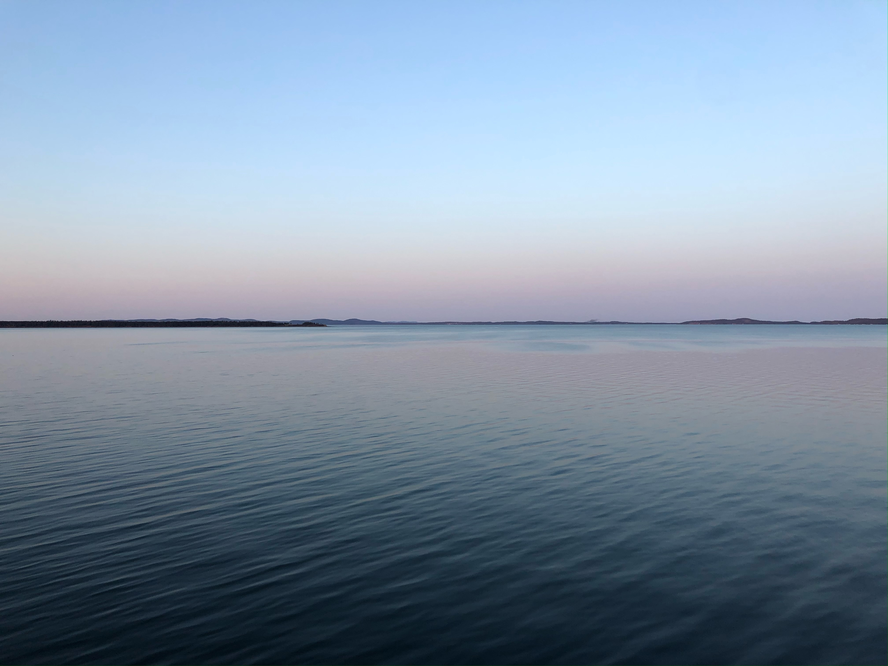
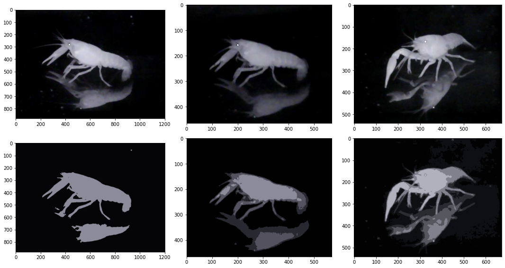

 

 
 
 

 # <strong><em>  Aquatic Arthropod Trapping with CV  </em></strong>

##  1.01 Introduction.  

In the lobster country of New England, from Massachusetts to Nova Scotia, lobster trapping practices waste immense amounts of time and resources as fishermen check all traps everyday to look for lobster. Often these traps come up empty, but if the traps aren't checked and they contain lobster then these lobsters can die or be eaten by other more agile animals. For this reason, traps must be checked constantly. This wastes immense amounts of fuel and time. Remote sensing technology in this field could improve the efficiency of these fishermen, could save on fuel expenses and emissions, and could potentially allow a fisherman to put traps in a greater range of locations.  

Using an automated set up, a 2000+ image dataset has been produced from different live crawfish of varying sizes living in an aquarium. These images are being used to train a model to recognize crawfish vs non-crawfish objects (e.g. fish, shells, rocks, etc). This classification model will aid in object detection for the automated counting and measurement of live crawfish entering and exiting an open trap set within an aquarium. This computer vision apparatus will be set up to function in the low light environment of the deep ocean. Experimentation of this kind has been done with other livestock and aquaculture organisms like cows, sheep, pigs, and fish, but little work of this kind has been done with aquatic arthropods. To date, I know of no work of this kind that has been done with lobsters or crawfish. Classification metrics will be used to quantify the success of the model and live functionality will be used to determine the success of the applied computer vision. 

 
 
 
 

 
 
 
 

^ CLICK TO PLAY VIDEO

 
 
 

^ CLICK TO PLAY VIDEO

 
 
 

